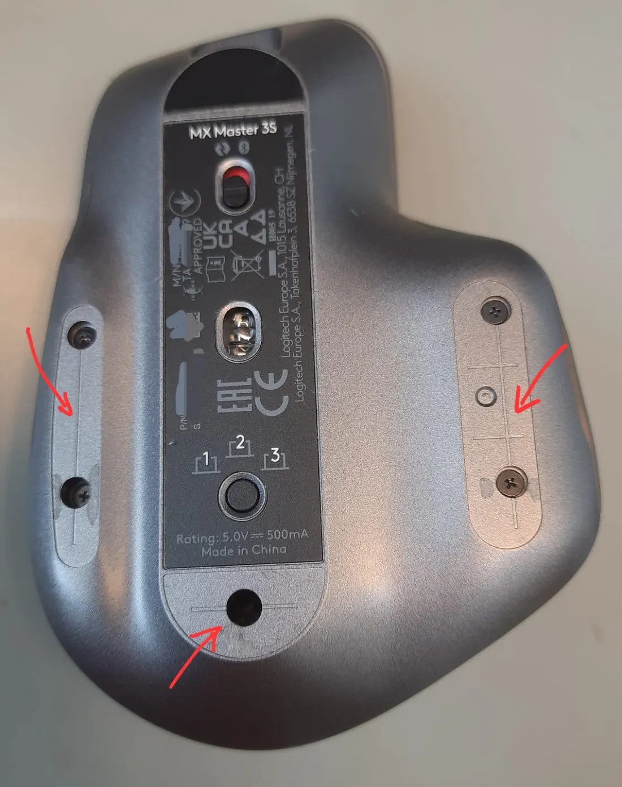
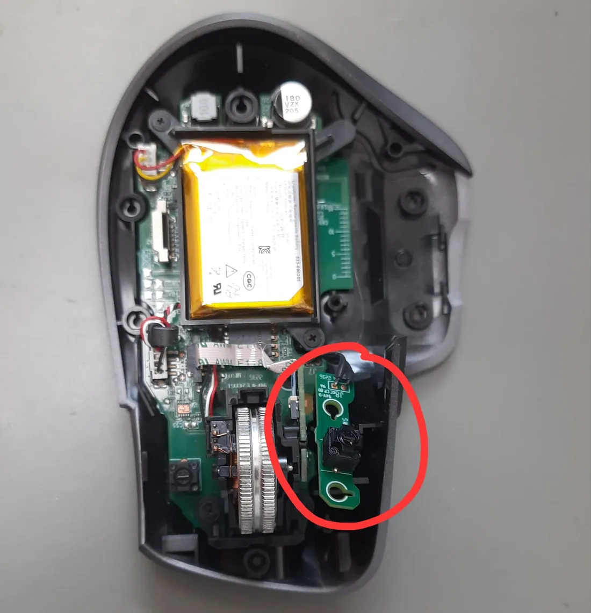

The Logitech MX Master 3S is an exceptional mouse, renowned for its ergonomic design and advanced features. However, after using it for about 15 months, I encountered an issue with the left button. The click wasn’t registering unless I applied significant force, which was frustrating and hindered productivity.

Although the mouse comes with a one-year warranty, mine had expired three months prior to the issue. As an engineer, I decided to take matters into my own hands and repair it myself. This blog post details my experience and provides a step-by-step guide to fixing the button click issue on the Logitech MX Master 3S.

## Sourcing the Replacement Parts

The Logitech MX Master 3S uses a switch manufactured by Panasonic. Replacing this switch is a relatively simple process, and there are two options to consider:

- EVQ-P0E07K

This is the switch I chose. It has a more clicky feel compared to the original switch, which I found quite satisfying. The cost was minimal, about 34 cents here in Germany.

- EVQ-P0D07K

While I haven’t personally tested this switch, it could offer a quieter click, similar to the original one.

These switches can be purchased from various electronic component retailers.

I recommend getting samples of both switches and choosing the one that suits your preference.

## Replacing the Faulty Switch
#### Disassembly
To disassemble the mouse, I found this YouTube video extremely helpful. It provides clear instructions and visuals to guide you through the process.

Tools Required:
- Screwdriver bits: PH00 and T5

Remove the black strips as shown above. It will expose the screws and you can easily remove them with the screw driver (PH00 and T5).

#### Replacement Process

- Desolder the Old Button: Carefully desolder the faulty switch from the circuit board. Make sure to handle the components gently to avoid any damage.
- Install the New Button: Solder the new switch in place of the old one. Ensure the solder joints are clean and secure.
- Test the Setup: Before reassembling the mouse, test the new switch to ensure it functions correctly. Once confirmed, close the enclosure and enjoy your fully functional mouse.

## Conclusion
With these steps, your Logitech MX Master 3S should be back in top working condition. While this issue can be frustrating, the repair is straightforward and cost-effective. Taking the DIY route not only saved me the hassle of finding a replacement mouse but also provided a satisfying experience of fixing the device myself.

If you’re facing a similar issue, I hope this guide helps you restore your mouse to its former glory. Happy fixing!