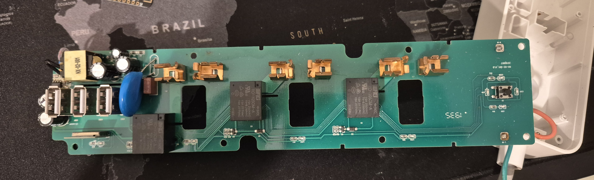
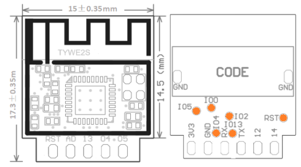
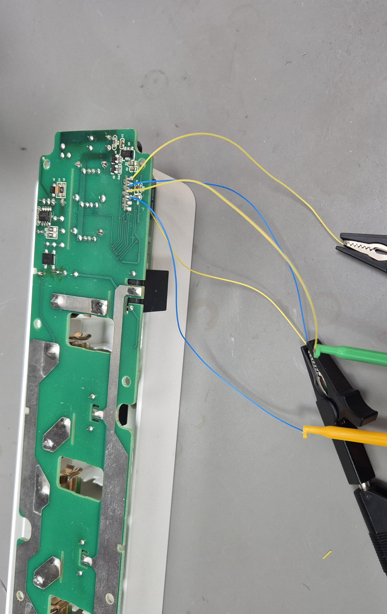
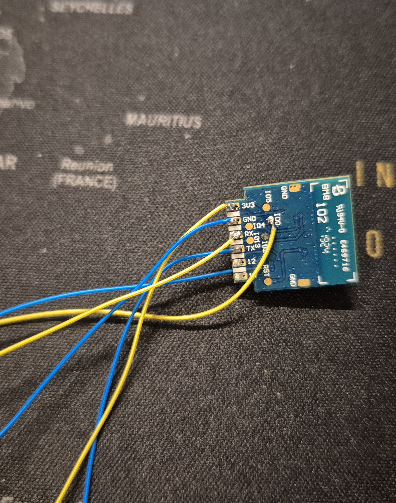

  
In a world increasingly reliant on IoT devices, it’s always unfortunate when a manufacturer shuts down and leaves once-functional gadgets as little more than e-waste. This is precisely what happened with IoT Monks Pvt Ltd, a company that produced IoT-enabled smart devices. Their closure left countless devices effectively bricked, including my trusty Smitch smart power strip purchased in 2019.

After five years of flawless operation, I wasn’t ready to throw it away. Instead, I decided to take matters into my own hands, hack the device, and give it a second life with custom firmware like ESPHome or Tasmota. Here’s how I did it, and how you can too!

Product Details:  
Smicth Smart Power Strip  
ID: SP 1603  

# Getting Started: Setting Up ESPHome
Since I already run Home Assistant on my homelab, integrating ESPHome was a straightforward task. I spun up an ESPHome docker instance, added it to my Traefik proxy, and voila, it was ready for action. This provided the foundation to build and upload a custom firmware for the power strip.

# Opening Up the Device

Disassembling the Smitch power strip revealed its brain: a TYWE2S module, which is based on the ESP8265. This chip is a staple in IoT devices and comes with impressive specs for its size:

Here is the [datasheet](https://developer.tuya.com/en/docs/iot/wifie2smodule?id=K9605u79tgxug) for more details on TYWE2S.



# Reverse Engineering the PCB
Without official schematics, I had to reverse engineer the board. Using a multimeter and careful tracing of PCB tracks, I mapped out the GPIO pins and deduced the following functionality:

- Switch 1 -> GPIO12 (active high)
- Switch 2 -> GPIO14 (active high)
- Switch 3 -> GPIO05 (active high)
- USB -> GPIO04 (active high)
- 3 Red LEDs -> GPIO13 (active low)
- 1 Blue LED -> GPIO01/TX (active low)
- Push Button -> GPIO03/RX (active low)
- RST -> NC
- AD -> NC

# Flashing the ESP8265
To flash the module, I needed to pull GPIO0 down during startup to put the ESP8265 into flashing mode. I soldered wires to RX, TX, GPIO0, GND, VCC pins and powered the device with 3.3V from an FTDI adapter. Unfortunately, my first attempts failed.



## Failed Attempt to Flash
Using esptool.py, I tried to detect the chip:
```bash
esptool.py --port <PORT> chip_id
```
This should return information about the board, but it didn’t work. Similarly, the command to detect flash size failed:
```bash
esptool.py --port <PORT> flash_id
```

## Successful Flash
After some troubleshooting, I decided to desolder the module from the PCB and try again.



In this attempt, esptool detected the chip.

Before flashing I took the dump of the flash just out of curiosity. At the end of this blog, you will find wat I found out in that flash.

After taking the dump of flash storage, I erased the it with following command:
```bash
esptool.py --port <PORT> erase_flash
```
I then flashed a base ESPHome firmware featuring Wi-Fi setup and OTA updates:
```bash
esptool.py --port <PORT> write_flash 0x00000 firmware.bin
```

But if you can directly take the complete yaml shown below and flash it.

# Adding Features: Restoring Full Functionality

With the base firmware in place, I started adding features one by one, mimicking the original functionality of the device. Features like per-socket control, push button, and LED indicators were configured in the ESPHome YAML.

Here’s the ESPHome YAML configuration:

```yaml
esphome:
  name: smitch-switch
  friendly_name: Smitch Smart Switch

esp8266:
  board: esp8285

# Enable logging
logger:

# Enable Home Assistant API
api:
 # encryption:         # Set your credentials
 #   key: "Your Key"

ota:
 # - platform: esphome
 #  password: "Your Key"

wifi:
  ssid: !secret wifi_ssid
  password: !secret wifi_password

  # Enable fallback hotspot (captive portal) in case wifi connection fails
  ap:
    ssid: "Smart-Switch Fallback Hotspot"
    password: "YourPassword"

captive_portal:
    
output:
  # Blue LED on Push Button
  - platform: gpio
    pin: 
      number: GPIO01 
      inverted: true  # Inverted because anode is connected to Vcc
    id: error_led_output

  # Red LED on Push Button
  - platform: gpio
    pin:
      number: GPIO13
      inverted: true
    id: red_led_output


switch:
  - platform: gpio
    name: "S1"
    pin: GPIO12
    id: relay1

  - platform: gpio
    name: "S2"
    pin: GPIO14
    id: relay2

  - platform: gpio
    name: "S3"
    pin: GPIO05
    id: relay3

  - platform: gpio
    name: "USB Power"
    pin: GPIO04
    id: usb_power
    
binary_sensor:
  # Push button for toggling relays
  - platform: gpio
    pin:
      number: GPIO3
      mode: INPUT_PULLUP  # Use pull-up resistor
      inverted: true  # Invert logic, as the button usually pulls the pin to ground
    id: button_input
    on_press:
      then:
        - lambda: |-
            bool all_on = id(relay1).state && id(relay2).state && id(relay3).state && id(usb_power).state;
            if (all_on) {
              // Turn all relays off
              id(relay1).turn_off();
              id(relay2).turn_off();
              id(relay3).turn_off();
              id(usb_power).turn_off();
            } else {
              // Turn all relays on
              id(relay1).turn_on();
              id(relay2).turn_on();
              id(relay3).turn_on();
              id(usb_power).turn_on();
            }

  # Template binary sensor to monitor relay states
  - platform: template
    name: "Switch Status"
    id: switch_status
    lambda: |-
      return (id(relay1).state || id(relay2).state || 
              id(relay3).state || id(usb_power).state);
    on_state:
      - then:
          - if:
              condition:
                binary_sensor.is_on: switch_status
              then:
                - output.turn_on: red_led_output
              else:
                - output.turn_off: red_led_output

  # System status for error indication
  - platform: status
    name: "System Status"
    id: system_status
    on_state:
      - then:
          - if:
              condition:
                binary_sensor.is_on: system_status
              then:
                - output.turn_off: error_led_output
              else:
                - output.turn_on: error_led_output

# Blink when WiFi is not available
interval:
  - interval: 0.5s
    then:
      - if:
          condition:
            not:
              wifi.connected:  # Check if Wi-Fi is disconnected
          then:
            - lambda: |-
                static bool state = false;
                state = !state;  // Toggle the LED state
                if (state) {
                  id(error_led_output).turn_on();
                } else {
                  id(error_led_output).turn_off();
                }
          else:
            - output.turn_off: error_led_output

web_server: # only for debugging, set auth if you wwant to use it later
```
  

# Inspecting the Firmware from Vendor: Security Compromises
When I checked the flash dump, To my surprise, Wi-Fi SSID and passwords were stored in plain text! This raises significant concerns about the security practices of the original vendor. If sensitive information like Wi-Fi credentials is stored in plain text, one can only imagine the level of security (or lack thereof) across the rest of the system.

This highlights an important aspect of IoT security — always question how your data is being handled by third-party devices. With custom firmware like ESPHome, you regain control and transparency over your device.

# Final Thoughts
While this project took some effort, it was worth it to save a perfectly good device from the landfill. It’s a satisfying blend of hacking, problem-solving, and sustainability. The added bonus? I now have complete control over my device without relying on a third-party cloud service.

If you have a bricked Smitch device or any other IoT device collecting dust, I hope this guide inspires you to breathe new life into it. Let’s save what we can and make the most out of our tech!

Happy hacking! 🚀